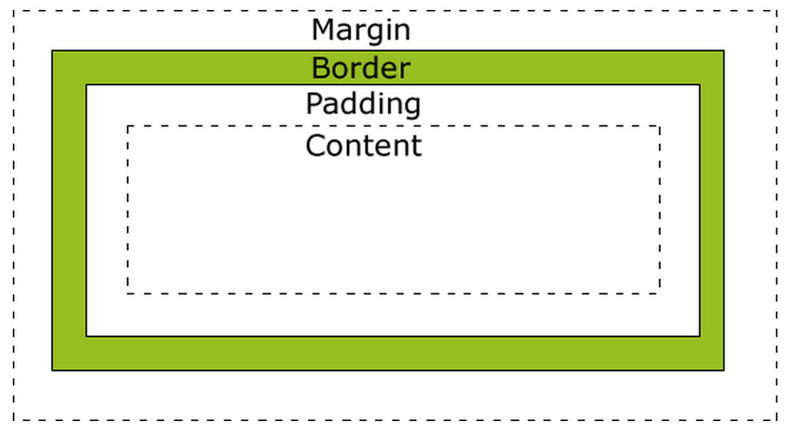

# The CSS Box Model

The primary rules to commit to memory about the CSS box model:

- **Block level elements**
  - Take up the height of their content, plus any margin, padding, or border.
  - Take up the full width of their parent's content box, minus any margin.
  - Can have an explicit width or height, in which case the above are ignored.
  - Appear on their own "line", i.e. no other elements may appear beside them.
- **Inline level elements**
  - Cannot have height or width set on them
  - Take up the height of their `line-height`, regardless of any margin,
    padding, or border.
  - Take up the width of their content, plus any margin, padding, or border.
  - Appear next to any other inline content.

## Additional resources
- [MDN on the box model](https://developer.mozilla.org/en-US/docs/Web/CSS/box_model)
