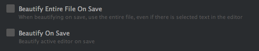
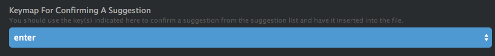

# Atom Recommended Packages
To install Atom packages, you can navigate to `Atom > Preferences > Install`,
search for the package name, and click Install

- atom-beautify
- atom-css-comb
- atom-handlebars
- autocomplete-plus
- autocomplete-html
- autocomplete-css
- atom-ternjs
- color-picker
- emmet
- html-entities
- linter
- linter-htmlhint
- linter-jshint
- linter-scss-lint
- merge-conflicts
- seti-syntax
- seti-ui
- the-closer

# Atom Recommended Settings

To change the settings for these packages, find the package in `Atom >
Preferences > Packages` and click the "Settings" button.

## atom-beautify
Make sure none of the "On Save" settings are selected

## autocomplete-plus
Change the "Keymap for Confirming a Suggestion" to "enter" so that it doesn't
conflict with emmet.

